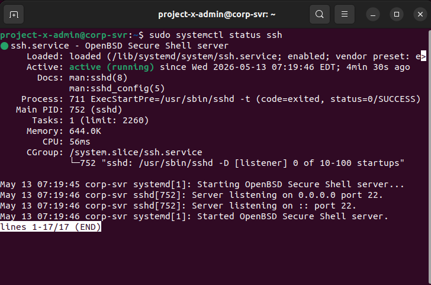
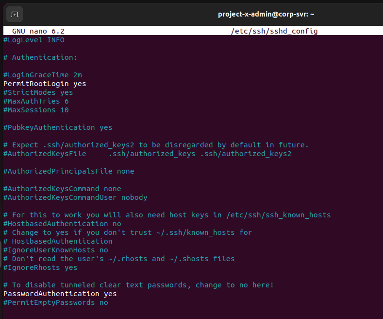
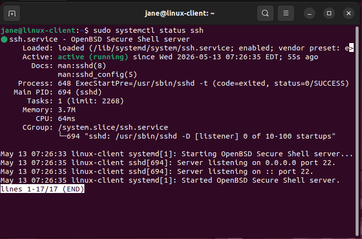
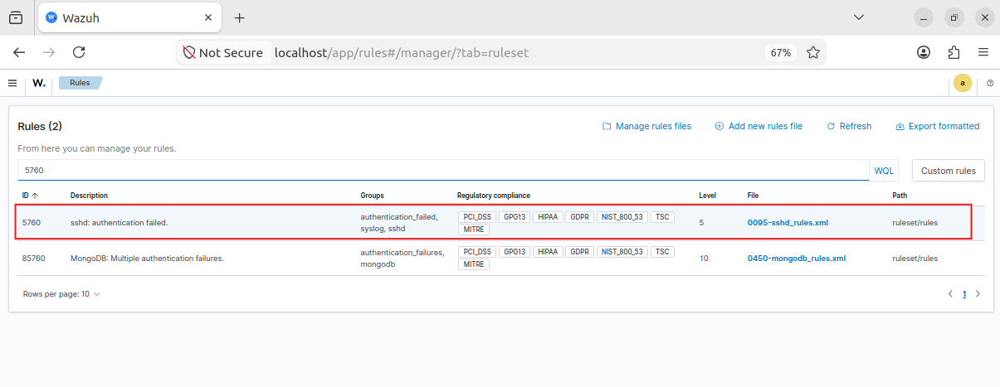
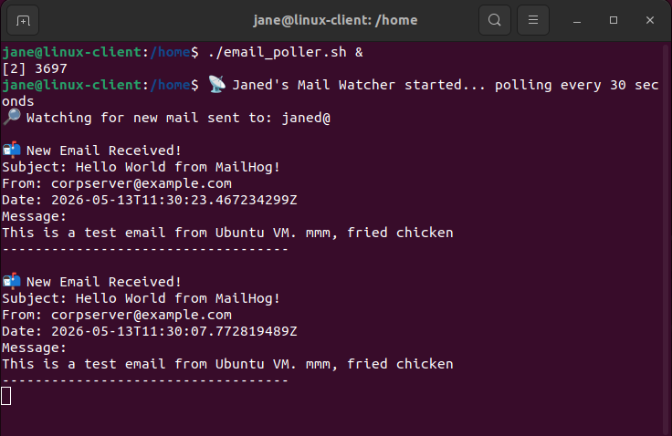
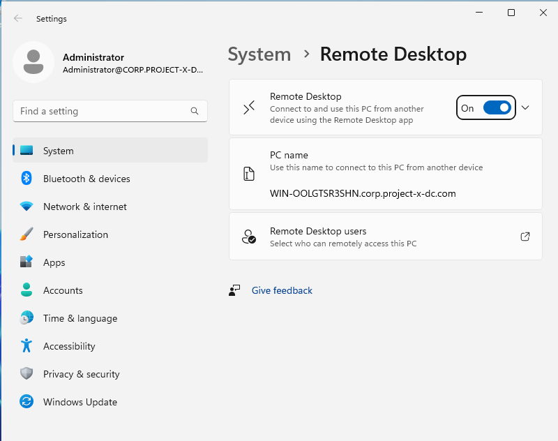
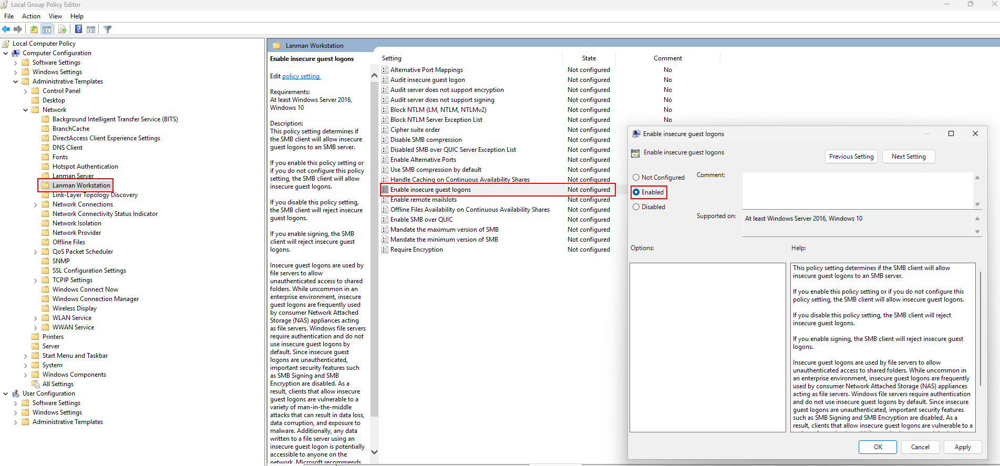

With the lab fully built, the next step is to deliberately introduce insecure configurations - the kind of misconfigurations and legacy settings that still appear in real enterprise networks more often than expected.

<!--more-->

Legacy systems, forgotten infrastructure, rushed deployments, and weak operational practices can all create exploitable attack surfaces inside production environments.

In this part of the series, the goal is to intentionally weaken selected systems inside the **Business-in-a-Box** homelab while simultaneously configuring **Wazuh** to monitor and detect the resulting attack activity.

> ⚠️ **Disclaimer:** Every configuration change in this section is strictly for the homelab. None of this should be applied to a production environment.

Before starting, ensure all VMs are up and Wazuh has been fully configured with agents deployed to the relevant machines.

## What We're Doing (and Why)

Each misconfiguration below is paired with a **detection note** explaining how Wazuh catches the resulting activity. This is the blue team layer sitting alongside the red team setup.

### 1. Enable SSH on project-x-corp-server

We open SSH on the corporate server and deliberately weaken its configuration by enabling password authentication and permitting root login — two settings that are disabled by default for good reason.

**Commands run on `project-x-corp-server`:**

```bash
sudo apt update && sudo apt install openssh-server -y
sudo systemctl start ssh && sudo systemctl enable ssh
sudo ufw allow 22 && sudo ufw enable
```

In `/etc/ssh/sshd_config`, we make two key changes:
- `PasswordAuthentication yes`
- `PermitRootLogin yes`

Then set root's password and restart SSH:

```bash
sudo passwd root       # set to: november
sudo systemctl restart ssh
```





> 🔍 **Detection Note:** `project-x-corp-server` does **not** have a Wazuh agent installed. This is intentional — it demonstrates the detection gap that exists when a machine has no endpoint monitoring. An attacker could brute-force this box and no SIEM alert would fire.

### 2. Enable SSH on project-x-linux-client

The same process is applied to the Linux client machine, with one key difference — this machine **does** have a Wazuh agent, so failed SSH attempts will be caught.

```bash
sudo apt update && sudo apt install openssh-server -y
sudo systemctl start ssh && sudo systemctl enable ssh
sudo ufw allow 22
```

Enable password authentication in `/etc/ssh/sshd_config` and restart SSH as above. Also set root's password to `november`.



> 🔍 **Detection Note (Wazuh Rule ID: 5760):** Wazuh has a built-in rule that fires on `sshd: authentication failed` events. View it under **Server Management -> Rules -> 5760**.



**Creating a Wazuh Alert for Failed SSH:**

In **Explore -> Alerting -> Monitors**, create a new monitor with the following:
- Title: `3 Failed SSH Attempts`
- Data source index: `wazuh-alerts-4.x-*`, Time field: `@timestamp`
- Data filters: `process.name = sshd` and `rule.groups = authentication_failed`
- Trigger condition: count > 2, Severity: Medium (3)

### 3. Configure the MailHog SMTP Email Connection


MailHog should already be running from the setup phase. Confirm the container is active on `project-x-corp-server`:

```bash
cd /home/mailhog
sudo docker compose up -d
```

On `project-x-linux-client`, start the email poller in the background:

```bash
cd /home && ./email_poller.sh &
```

This script polls the MailHog API every 30 seconds and simulates a user checking their inbox — a critical piece for the phishing simulation in Part 3.



> 🔍 **Detection Note:** Since `project-x-corp-server` has no Wazuh agent, email activity originating from it creates a monitoring blind spot — intentionally mirroring real-world scenarios where email infrastructure goes unmonitored.

### 4. Enable WinRM on project-x-win-client

Windows Remote Management (WinRM) is a legitimate administration protocol, but it's a commonly abused attack path for lateral movement. We enable it on the Windows client to expose this surface.

Open an **Administrator PowerShell** session on `project-x-win-client` and run:

```powershell
powershell -ep bypass
Enable-PSRemoting -force
winrm quickconfig -transport:https
Set-Item wsman:\localhost\client\trustedhosts *
net localgroup "Remote Management Users" /add administrator
Restart-Service WinRM
```


> 🔍 **Detection Note (Wazuh Rule ID: 60106):** WinRM connections use Kerberos authentication, which generates Windows Event ID `4624` with `logonProcessName: Kerberos`. Wazuh catches this under rule 60106 (`Windows Logon Success`).

**Creating a Wazuh Alert for WinRM Logon:**

Create a monitor titled "WinRM Logon" with:
- Data filters: `data.win.eventdata.logonProcessName = Kerberos` and `data.win.system.eventID = 4624`
- Trigger condition: count > 1, Severity: Medium (3)

### 5. Enable RDP on project-x-dc (Domain Controller)

Navigate to **Settings -> System -> Remote Desktop** on the domain controller and toggle it **On**. This exposes RDP (port 3389) on the DC — the highest-value machine in the network.



> 🔍 **Detection Note (Wazuh Rule ID: 92653):** Successful RDP logins generate Event ID `4624` with `logonProcessName: User32`. Search for it in Wazuh under **Explore -> Discover** using `data.win.eventdata.logonProcessName: User32`.

### 6. Create a Sensitive File on project-x-dc

This simulates the crown jewels of our fictional company. On the domain controller, create:

- Path: `C:\Users\Administrator\Documents\ProductionFiles\secrets.txt`
- Content: anything representing sensitive data (the lab uses `DEEBOODAH`)


**Configure Wazuh File Integrity Monitoring (FIM):**

In Wazuh, go to **Server Management -> Endpoint Groups -> Windows -> Files -> agent.conf** and add:

```xml
<syscheck>
  <directories check_all="yes" report_changes="yes" realtime="yes">
    C:\Users\Administrator\Documents\ProductionFiles
  </directories>
  <frequency>60</frequency>
</syscheck>
```


**Creating a Custom FIM Alert:**

In **Server Management -> Rules -> local_rules.xml**, add:

```xml
<group name="syscheck">
  <rule id="100002" level="10">
    <field name="file">secrets.txt</field>
    <match>modified</match>
    <description>File integrity monitoring alert - access to secrets.txt file detected</description>
  </rule>
</group>
```

Then create a Wazuh monitor titled "File Accessed" with:
- Data filters: `syscheck.event = modified` and `full_log contains secrets.txt`
- Trigger condition: count > 1, Severity: High (2)

### 7. Prepare the Exfiltration Target on project-x-attacker

Enable SSH on the Kali machine and create a placeholder file for the incoming exfiltrated data:

```bash
sudo systemctl start ssh.service
touch /home/attacker/my_exfil.txt
```

On `project-x-win-client`, open `gpedit.msc` (navigate to `C:\Windows\System32\gpedit.msc`, right-click, Run as Administrator), then enable:

**Computer Configuration -> Administrative Templates -> Network -> Lanman Workstation -> Enable insecure guest logons** (set to Enabled)

Then run in PowerShell:

```powershell
Set-ItemProperty -Path "HKLM:\SYSTEM\CurrentControlSet\Services\LanmanWorkstation\Parameters" -Name AllowInsecureGuestAuth -Value 1 -Force
```



*The lab is now intentionally vulnerable and monitored. In Part 3, we run the actual attack — following the full cyber attack lifecycle from reconnaissance all the way to persistence.*
