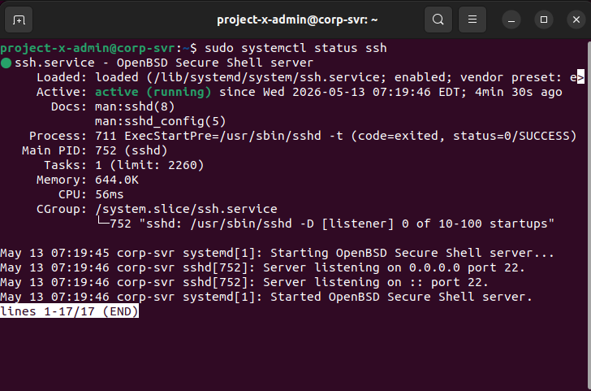
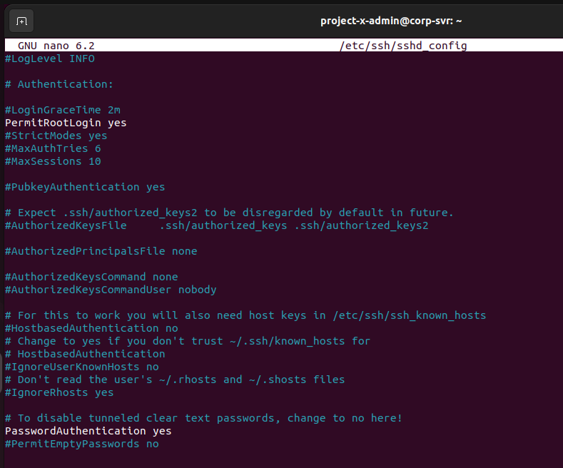
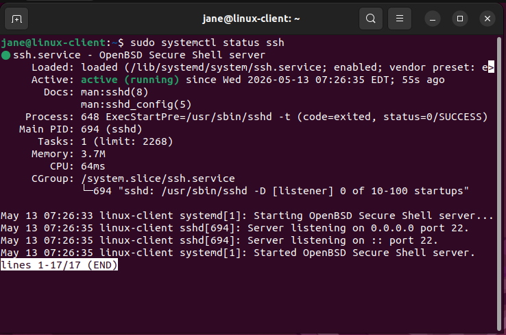
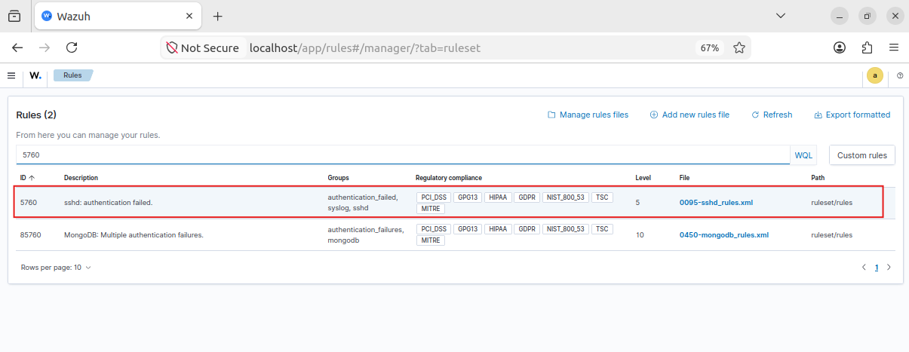
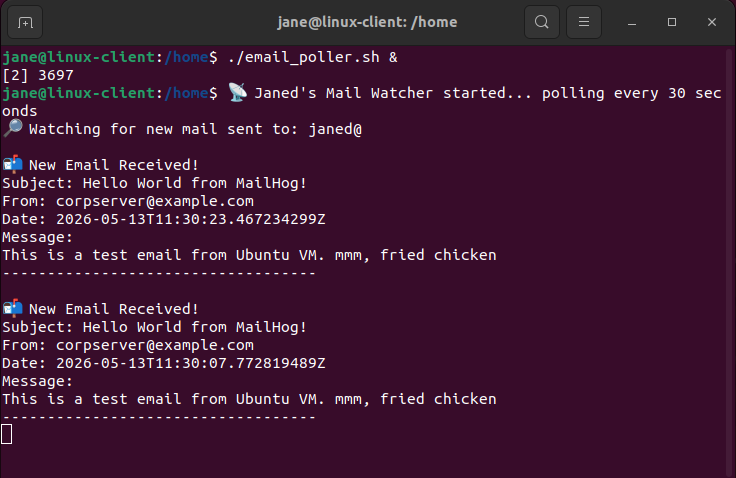
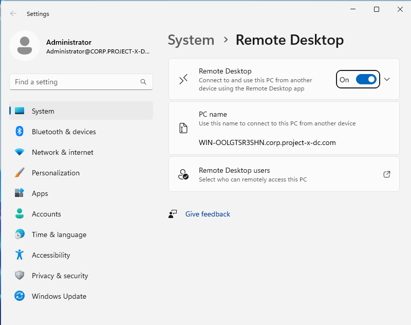
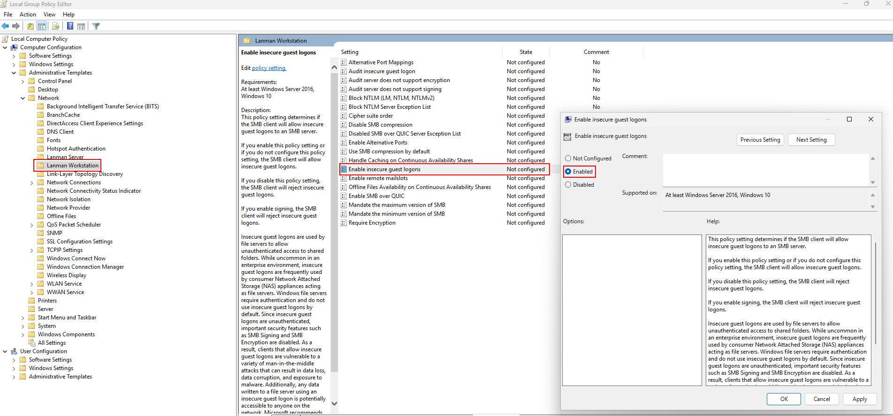

With the lab fully built, my next step was to deliberately introduce insecure configurations - the kind of misconfigurations and legacy settings that I know still appear in real enterprise networks more often than expected.

<!--more-->

Legacy systems, forgotten infrastructure, rushed deployments, and weak operational practices can all create exploitable attack surfaces inside production environments.

In this part of the series, my goal is to intentionally weaken selected systems inside the **Business-in-a-Box** homelab I built, while simultaneously configuring **Wazuh** to monitor and detect the resulting attack activity.

> ⚠️ **Disclaimer:** Every configuration change I make in this section is strictly for my homelab. None of this should be applied to a production environment.

Before starting, I ensured all my VMs were up and Wazuh was fully configured with agents deployed to the relevant machines.

## What I'm Doing (and Why)

I paired each misconfiguration below with a **detection note** explaining how Wazuh catches the resulting activity. This forms the blue team layer sitting alongside my red team setup.

### 1. Enable SSH on project-x-corp-server

I opened SSH on the corporate server and deliberately weakened its configuration by enabling password authentication and permitting root login — two settings that are disabled by default for good reason.

**Commands I ran on `project-x-corp-server`:**

```bash
sudo apt update && sudo apt install openssh-server -y
sudo systemctl start ssh && sudo systemctl enable ssh
sudo ufw allow 22 && sudo ufw enable
```

In `/etc/ssh/sshd_config`, I made two key changes:
- `PasswordAuthentication yes`
- `PermitRootLogin yes`

Then I set root's password and restarted SSH:

```bash
sudo passwd root       # set to: november
sudo systemctl restart ssh
```


*Here I confirmed the SSH service on my project-x-corp-server is active and running.*


*I uncommented the PasswordAuthentication and PermitRootLogin lines in my /etc/ssh/sshd_config to deliberately weaken the server.*

> 🔍 **Detection Note:** My `project-x-corp-server` does **not** have a Wazuh agent installed. This is intentional — I wanted to demonstrate the detection gap that exists when a machine has no endpoint monitoring. An attacker could brute-force this box and no SIEM alert would fire.

### 2. Enable SSH on project-x-linux-client

I applied the same process to my Linux client machine, with one key difference — this machine **does** have a Wazuh agent, so failed SSH attempts will be caught.

```bash
sudo apt update && sudo apt install openssh-server -y
sudo systemctl start ssh && sudo systemctl enable ssh
sudo ufw allow 22
```

I enabled password authentication in `/etc/ssh/sshd_config` and restarted SSH as above. I also set root's password to `november`.


*Checking that the SSH service on my project-x-linux-client is successfully running.*

> 🔍 **Detection Note (Wazuh Rule ID: 5760):** Wazuh has a built-in rule that fires on `sshd: authentication failed` events. I can view it under **Server Management -> Rules -> 5760**.


*Here I found Rule ID 5760 in Wazuh, which handles "sshd: authentication failed" events.*

**Creating a Wazuh Alert for Failed SSH:**

In **Explore -> Alerting -> Monitors**, I created a new monitor with the following:
- Title: `3 Failed SSH Attempts`
- Data source index: `wazuh-alerts-4.x-*`, Time field: `@timestamp`
- Data filters: `process.name = sshd` and `rule.groups = authentication_failed`
- Trigger condition: count > 2, Severity: Medium (3)

### 3. Configure the MailHog SMTP Email Connection


*A quick diagram showing how I set up my MailHog SMTP connection.*

MailHog should already be running from the setup phase. I confirmed the container is active on `project-x-corp-server`:

```bash
cd /home/mailhog
sudo docker compose up -d
```

On `project-x-linux-client`, I started the email poller in the background:

```bash
cd /home && ./email_poller.sh &
```

This script polls the MailHog API every 30 seconds and simulates a user checking their inbox — a critical piece for the phishing simulation I run in Part 3.


*My email_poller.sh script running smoothly in the background on my Linux client.*

> 🔍 **Detection Note:** Since my `project-x-corp-server` has no Wazuh agent, email activity originating from it creates a monitoring blind spot — intentionally mirroring real-world scenarios where email infrastructure goes unmonitored.

### 4. Enable WinRM on project-x-win-client

Windows Remote Management (WinRM) is a legitimate administration protocol, but it's a commonly abused attack path for lateral movement. I enabled it on the Windows client to expose this surface.

I opened an **Administrator PowerShell** session on `project-x-win-client` and ran:

```powershell
powershell -ep bypass
Enable-PSRemoting -force
winrm quickconfig -transport:https
Set-Item wsman:\localhost\client\trustedhosts *
net localgroup "Remote Management Users" /add administrator
Restart-Service WinRM
```


*Successfully enabling WinRM via PowerShell on my Windows client.*

> 🔍 **Detection Note (Wazuh Rule ID: 60106):** WinRM connections use Kerberos authentication, which generates Windows Event ID `4624` with `logonProcessName: Kerberos`. Wazuh catches this under rule 60106 (`Windows Logon Success`).

**Creating a Wazuh Alert for WinRM Logon:**

I created a monitor titled "WinRM Logon" with:
- Data filters: `data.win.eventdata.logonProcessName = Kerberos` and `data.win.system.eventID = 4624`
- Trigger condition: count > 1, Severity: Medium (3)

### 5. Enable RDP on project-x-dc (Domain Controller)

I navigated to **Settings -> System -> Remote Desktop** on the domain controller and toggled it **On**. This exposes RDP (port 3389) on my DC — the highest-value machine in the network.


*Exposing RDP by turning on Remote Desktop settings on my domain controller.*

> 🔍 **Detection Note (Wazuh Rule ID: 92653):** Successful RDP logins generate Event ID `4624` with `logonProcessName: User32`. I can search for it in Wazuh under **Explore -> Discover** using `data.win.eventdata.logonProcessName: User32`.

### 6. Create a Sensitive File on project-x-dc

This simulates the crown jewels of my fictional company. On the domain controller, I created:

- Path: `C:\Users\Administrator\Documents\ProductionFiles\secrets.txt`
- Content: anything representing sensitive data (I used `DEEBOODAH` for this lab)


*Creating my simulated "crown jewels" sensitive file on the DC.*

**Configure Wazuh File Integrity Monitoring (FIM):**

In Wazuh, I went to **Server Management -> Endpoint Groups -> Windows -> Files -> agent.conf** and added:

```xml
<syscheck>
  <directories check_all="yes" report_changes="yes" realtime="yes">
    C:\Users\Administrator\Documents\ProductionFiles
  </directories>
  <frequency>60</frequency>
</syscheck>
```


*Editing my Wazuh agent.conf to set up File Integrity Monitoring for the ProductionFiles directory.*


*Verifying that Wazuh's FIM inventory has picked up my new secrets.txt file.*

**Creating a Custom FIM Alert:**

In **Server Management -> Rules -> local_rules.xml**, I added:

```xml
<group name="syscheck">
  <rule id="100002" level="10">
    <field name="file">secrets.txt</field>
    <match>modified</match>
    <description>File integrity monitoring alert - access to secrets.txt file detected</description>
  </rule>
</group>
```

Then I created a Wazuh monitor titled "File Accessed" with:
- Data filters: `syscheck.event = modified` and `full_log contains secrets.txt`
- Trigger condition: count > 1, Severity: High (2)

### 7. Prepare the Exfiltration Target on project-x-attacker

I enabled SSH on my Kali machine and created a placeholder file for the incoming exfiltrated data:

```bash
sudo systemctl start ssh.service
touch /home/attacker/my_exfil.txt
```

On `project-x-win-client`, I opened `gpedit.msc` (navigated to `C:\Windows\System32\gpedit.msc`, right-clicked, Run as Administrator), then enabled:

**Computer Configuration -> Administrative Templates -> Network -> Lanman Workstation -> Enable insecure guest logons** (set to Enabled)

Then I ran in PowerShell:

```powershell
Set-ItemProperty -Path "HKLM:\SYSTEM\CurrentControlSet\Services\LanmanWorkstation\Parameters" -Name AllowInsecureGuestAuth -Value 1 -Force
```


*Enabling insecure guest logons on the Windows client via the Group Policy Editor.*

*My lab is now intentionally vulnerable and monitored. In Part 3, I will run the actual attack — following the full cyber attack lifecycle from reconnaissance all the way to persistence.*
