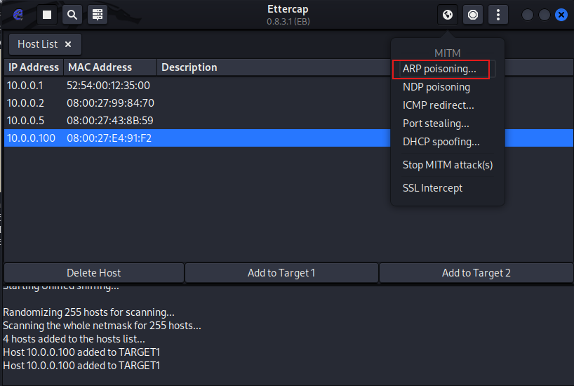
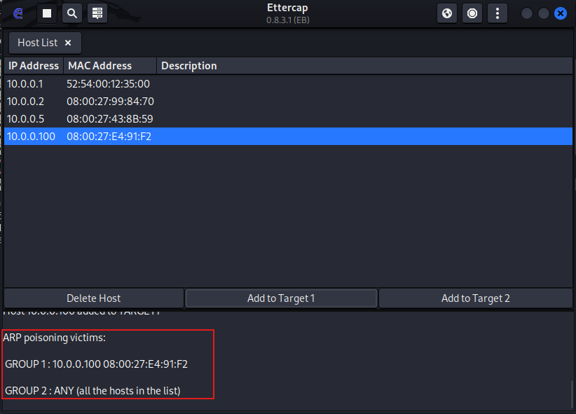

## Prerequisites

Before starting, make sure the following are in place:

1. VirtualBox or VMware Workstation Pro installed
2. `project-x-win-client` is turned on and configured
3. `project-x-attacker` is turned on

## Scenario
 
In this scenario, the attacker (`project-x-attacker`) is already positioned on the same local network as the victim (`project-x-win-client`). Both machines sit within the `10.0.0.0/24` subnet. The attacker exploits the lack of authentication in the ARP protocol to associate their MAC address with the IP of a legitimate device on the network — silently inserting themselves between the victim and the rest of the network without either side noticing.

## Likeliness Meter


**Rating: Moderate to Unlikely**

ARP is a Layer 2 protocol — this means the attacker must already be *inside* the local network, either physically or logically (via Wi-Fi or an already-infected endpoint). Most modern breaches are carried out remotely without the attacker needing to be locally present. End-to-end encryption is also widely used today, and the detection signals from ARP poisoning are fairly verbose — flooding ARP tables is noisy and relatively easy to spot with the right monitoring in place.

## Background: Address Resolution Protocol (ARP)

Before jumping into the attack, it helps to understand what ARP actually does.

**Address Resolution Protocol (ARP)** is responsible for mapping IP addresses to MAC addresses on a local network. When a device wants to communicate with another device on the same LAN, it doesn't just send a packet to an IP address — it needs to know the physical MAC address of the destination. ARP handles this lookup.

Here's the basic flow:

1. Device A wants to talk to `10.0.0.100` but doesn't know its MAC address
2. Device A broadcasts an ARP request to the entire network: *"Who has `10.0.0.100`? Tell me your MAC."*
3. The device at `10.0.0.100` replies with its MAC address
4. Device A stores this mapping in its **ARP cache** (also called the ARP table) for quick future reference

The ARP table is essentially a local lookup table — each device on the network maintains one, and it stores the IP-to-MAC mappings it has seen recently. This avoids having to re-broadcast ARP requests every single time a packet needs to be sent.

A key thing to note: **ARP has no authentication**. Any device can send an ARP reply claiming any IP-to-MAC mapping, and the receiving device will accept it and update its cache accordingly. This is the root cause of the vulnerability we're exploiting.

## How ARP Cache Poisoning Works

ARP cache poisoning (also called ARP spoofing) exploits that lack of authentication. The attacker floods the victim's ARP table with fake ARP replies, associating their own MAC address with the IP of a legitimate device — typically the network gateway or another host.

Once the victim's ARP cache is poisoned:
- Any traffic the victim sends to `10.0.0.1` (the gateway) gets routed to the attacker's machine instead
- The attacker sits in the middle, intercepting and optionally forwarding traffic
- From the victim's perspective, everything looks normal — they can still reach the internet and local services

This is the classic **Man-in-the-Middle (MiTM)** position: the attacker can read, modify, or drop any traffic flowing through them.

### Ettercap

We're using **Ettercap** to carry out the attack. Ettercap is an open-source MiTM toolkit that ships natively with Kali Linux. It supports both active and passive eavesdropping on local network connections and provides a straightforward GUI for running ARP poisoning attacks without having to craft packets manually.

> 💡 An alternative CLI-based tool called **Bettercap** can accomplish the same thing — worth exploring if you prefer a terminal-based workflow.

## Security Implications

Why would an attacker bother with ARP cache poisoning?

The primary goal is **impersonation and traffic interception**. Since the victim is typically an authorised device on the internal network, the attacker can leverage that trusted position to:

- **Intercept credentials** — If traffic is unencrypted (HTTP, FTP, plain SMTP), usernames and passwords pass through the attacker in plaintext
- **Session hijacking** — Capture session cookies to take over authenticated web sessions
- **Inject malicious content** — Modify HTTP responses in transit to serve malware or redirect to phishing pages
- **Eavesdrop on internal comms** — Read internal emails, file transfers, or API calls happening over the LAN

**The detection opportunity** is actually significant here. ARP requests and responses are not one-to-one — they broadcast out to the *entire network*. This means every device on the subnet receives the attacker's spoofed ARP broadcasts, not just the target. A sudden flood of ARP replies from an unknown MAC address mapping itself to a known IP is a strong signal that something is wrong, and it's exactly the kind of anomaly that network monitoring tools like Wireshark or Suricata can catch.

## Running the Attack

### Step 1 — Check the Victim's ARP Table (Baseline)

On `project-x-win-client`, open a Command Prompt and view the current ARP table:

```cmd
arp -a
```

You should see the standard devices on the network — the domain controller, corporate server, and other workstations — each with their correct MAC-to-IP mappings. Take note of the entry for the default gateway.


### Step 2 — Launch Ettercap on the Attacker Machine

Navigate to `project-x-attacker` (Kali Linux).

Search for **Ettercap** in the application menu and launch it. Enter the attacker's password when prompted.


In the Ettercap UI, confirm the **Primary Interface** is set to `eth0` — this is the interface connected to the `10.0.0.0/24` NAT network.

Click the **✅ checkmark** to start the capture.


### Step 3 — Discover Hosts

With the capture running, navigate to **Hosts List** in the top-left menu.

Ettercap will display the IP addresses of all reachable hosts it has discovered on the local network — you should see the familiar `10.0.0.x` addresses of the lab machines.


### Step 4 — Start Wireshark Capture

Before triggering the ARP poison, open **Wireshark** on the Kali machine via the search bar and start a capture on `eth0`. We want to capture the ARP traffic in real time as the attack runs.

### Step 5 — Launch the ARP Poisoning Attack

Back in Ettercap, go to the top-right panel and select **MiTM → ARP Poisoning...**



A dialogue box will appear. Make sure **"Sniff remote connections."** is checked, then click **OK**.


You will see new messages appended to the Ettercap log panel at the bottom, confirming the ARP poisoning has begun.



### Step 6 — Observe the Attack in Wireshark

Switch back to Wireshark and stop the capture.

Filter for ARP traffic and examine the ARP requests and responses. Look closely at the MAC address mappings — you should be able to see that **`10.0.0.100`'s MAC address is now mapped to the attacker's MAC address** in the captured packets.


### Step 7 — Confirm the Poisoned ARP Table on the Victim

Navigate back to `project-x-win-client` and run `arp -a` again:

```cmd
arp -a
```


The ARP table now shows the attacker's MAC address mapped to legitimate IP addresses in the network. The victim's device will now route traffic intended for those IPs directly to the attacker's machine.

Also notice something important from the output: **the attacker's MAC address has propagated across all other entries in the ARP table** — not just the single target IP. This is the detection footprint of the attack. Every device on the subnet received the attacker's spoofed ARP broadcasts, and a network monitor watching for unusual MAC-to-IP churn would flag this immediately.

## Conclusion

ARP cache poisoning is a foundational MiTM technique that exploits one of the oldest and most fundamental weaknesses in networking protocols — the total absence of authentication in ARP. The attack itself is straightforward to execute with Ettercap, but its real-world applicability is limited by one hard requirement: **the attacker must already be on the same Layer 2 network segment as the victim**.

That constraint is why this attack is rated **Moderate to Unlikely**. In a modern enterprise environment where remote access is the norm, physically or logically landing on the internal LAN is already a significant hurdle. And once the attack is running, it's noisy — the ARP broadcasts are visible to every device on the subnet, making it one of the more detectable MiTM techniques available.

That said, it remains relevant in scenarios involving:
- Rogue insider threats already on the internal network
- Compromised devices used as a pivot point
- Unmonitored Wi-Fi networks where lateral positioning is easy

The key takeaway from the blue team side: **monitor your ARP tables**. Unexpected MAC address changes on known IP addresses, or a single MAC address associating itself with multiple IPs, are strong indicators of an ARP poisoning attempt in progress.

---

*Next up — MiTM: DNS Zone Poisoning, where we take a similar concept and apply it at the DNS layer.*
