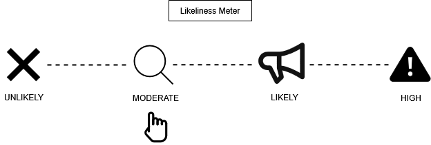

# Attack 3 — IP Spoofing

## Prerequisites

Before starting, make sure the following are in place:

1. VirtualBox or VMware Workstation Pro installed
2. `project-x-linux-client` is turned on and logged in
3. `project-x-attacker` is turned on

## Scenario
 
In this scenario, the attacker (`project-x-attacker`) is already on the same `10.0.0.0/24` subnet as the victim. Rather than targeting the victim's machine directly, the attacker targets the **network gateway** (`10.0.0.1`) — the single point all devices on the subnet use to communicate outward. By flooding the gateway's ARP table with a fake MAC-to-IP mapping, the attacker convinces the gateway that their machine is Jane Doe's workstation (`project-x-linux-client`, `10.0.0.101`). Any traffic routed through the gateway will then treat the attacker as if they are Jane.

## Likeliness Meter



**Rating: Moderate**

Classic IP spoofing breaks TCP handshakes — because the attacker receives no reply traffic (responses go back to the real IP owner), completing a proper three-way handshake is not possible. Modern services also tend to rely on cryptographic authentication well beyond just trusting a source IP. That said, it still rates **Moderate** because connectionless, one-way scenarios — like UDP-based DDoS amplification attacks — don't need a handshake at all. For those use cases, IP spoofing remains a practically relevant and widely abused technique. The other hard constraint: the attacker must be on the same local network as the device they're impersonating.

## Background: IP Spoofing

Before jumping into the attack, it helps to understand what IP spoofing actually is and why it works.

**IP spoofing** is the act of falsifying the source IP address in a packet header to make traffic appear as though it is originating from a trusted or different source. Every IP packet contains a header with fields for the source and destination IP address — and unlike higher-level protocols like TLS, the IP layer itself has no mechanism to verify whether the source address is legitimate. It simply trusts what it's told.

Tools and custom code can be used to inject a fake IP address into the IP header, making traffic look like it came from anywhere the attacker chooses. IP spoofing can be deployed to simulate, mask, or hide the attacker's real network traffic through a legitimate device — with the key limitation that the attacker must already be part of the same local network as the device they're intending to impersonate.

## How IP Spoofing Works

The foundation of IP spoofing is at the packet level. IP packets contain headers with information about the packet — including the source and destination IP address. When an attacker crafts a packet with a forged source IP, any device or service that receives it and trusts based on IP alone will believe the traffic came from the spoofed address.

In a local network context, IP spoofing is typically layered on top of ARP manipulation. The attacker floods the **network gateway's** ARP table with fake MAC-to-IP mappings — associating their own MAC address with the victim's IP. Once the gateway accepts the spoofed entry, it routes traffic accordingly, and the attacker's machine effectively presents itself as the victim to the rest of the network.

### NetImpostor

We're using **[NetImpostor](https://github.com/tastypepperoni/NetImpostor)** to carry out the attack — a brand new open-source IP spoofing tool discovered while building this exercise. All credit to its developer, tastypepperoni.

NetImpostor works by flooding fake IP-to-MAC mappings to the ARP table of the victim network's gateway. Once the spoofed entry is in place, it uses a **SOCKS5 proxy** to route traffic through the spoofed IP address — since the attacker will have both their real IP and the spoofed IP active simultaneously, proxychains facilitates communication specifically for the spoofed identity.

> 💡 For a deeper technical breakdown of how NetImpostor achieves stateful connections with a spoofed source IP, read the developer's own writeup: [Stateful connection with spoofed source IP — NetImpostor](https://tastypepperoni.medium.com/stateful-connection-with-spoofed-source-ip-netimpostor-ece8b950a981)

## Security Implications

Why does IP spoofing matter?

The primary use cases are **impersonation, traffic misdirection, and attack obfuscation**. An attacker who can present a trusted source IP can exploit environments that rely on IP-based access controls to:

- **Bypass IP allowlists** — Firewall rules, internal APIs, or legacy systems that trust based on IP alone can be fooled
- **Amplify DDoS attacks** — Spoofed source IPs are the backbone of reflection and amplification attacks, where requests are sent to public servers (DNS resolvers, NTP servers) with the victim's IP as the return address — causing those servers to flood the victim with responses
- **Obscure attack origin** — Traffic logs point to the spoofed IP rather than the attacker's real address, complicating forensic investigation and incident response

**The detection opportunity** is the same as with ARP cache poisoning — NetImpostor's ARP flooding leaves visible signals in packet captures. A single MAC address associating itself with multiple IPs, or an unexpected MAC-to-IP mapping at the gateway, are the giveaways. Wireshark catches this clearly, as we'll see.

## Running the Attack

### Step 1 — Set Up NetImpostor on the Attacker Machine

Navigate to `project-x-attacker` (Kali Linux).

Go to the attacker's home directory and clone the NetImpostor repository:

```bash
cd ~
git clone https://github.com/tastypepperoni/NetImpostor.git
cd NetImpostor
```


NetImpostor is written in Go, so install the Go compiler and build the binary:

```bash
sudo apt-get update
sudo apt install golang-go -y
go build -o NetImpostor
```

You'll see Go pulling in dependencies during the build. Once complete, run `ls` to confirm the `NetImpostor` executable has been created.


### Step 2 — Configure Proxychains

NetImpostor routes spoofed traffic through a SOCKS5 proxy on port `1080`. The default proxychains config uses a different port, so we need to update it:

```bash
sudo nano /etc/proxychains4.conf
```

Scroll to the very bottom of the file and change the last line to:

```
socks5 127.0.0.1 1080
```

Save and exit.


### Step 3 — Start a Wireshark Capture

Before running NetImpostor, open **Wireshark** on the Kali machine via the search bar and start a capture on `eth0`. We want to capture the spoofed traffic in real time as the attack runs — this will be our confirmation that the spoofing worked.

### Step 4 — Run NetImpostor

Open a terminal on `project-x-attacker` and run NetImpostor, targeting the network gateway and specifying Jane's workstation as the IP to impersonate:

```bash
sudo ./NetImpostor -i eth0 --impersonate 10.0.0.101 --targets 10.0.0.1
```

- `-i eth0` — the network interface to use
- `--impersonate 10.0.0.101` — Jane's workstation IP, the address we're spoofing
- `--targets 10.0.0.1` — the network gateway whose ARP table we're flooding


### Step 5 — Send Traffic Through the Spoofed IP

Open a **new terminal tab** and route a `curl` request through proxychains — this forces the request to travel through the SOCKS5 proxy using `10.0.0.101` as the source IP instead of the attacker's real address:

```bash
proxychains curl https://google.com/
```

> 💡 You may get a `socket error or timeout` on the first attempt — this is normal. NetImpostor needs a moment to propagate the spoofed ARP entry to the gateway. Try the command a few more times.


### Step 6 — Confirm the Spoofing in NetImpostor Output

Switch back to the first terminal tab where NetImpostor is running.

You will see output confirming the spoofing is active — NetImpostor logs that it has successfully associated `10.0.0.101` with the attacker's MAC address at the gateway.


### Step 7 — Confirm the Spoofed Traffic in Wireshark

Switch back to Wireshark and stop the capture.

Scroll through the captured packets looking for ARP entries. You're looking for two key signals:

1. An ARP reply showing `10.0.0.101` mapped to the **attacker's MAC address** — this is the spoofed entry NetImpostor injected into the gateway's ARP table
2. An outbound packet to Google's public IP showing **`10.0.0.101` as the source** — confirming traffic actually left the attacker's machine presenting Jane's IP


We have successfully IP spoofed Jane's workstation (`10.0.0.101`). From the network's perspective, the traffic came from Jane — even though Jane's machine never sent a single packet.

## Conclusion

IP spoofing is one of those techniques that sounds more powerful than it often is in practice. Modern cryptographic authentication — TLS, signed tokens, certificates — means that simply presenting a trusted source IP rarely grants meaningful access to a well-secured service. And because classic IP spoofing breaks TCP handshakes, two-way communication with the spoofed identity is limited.

That said, it remains a relevant and actively used technique in the right contexts:
- **DDoS amplification** — where connectionless UDP traffic is all that's needed
- **Internal network impersonation** — where legacy systems or internal APIs still make access decisions based on IP alone
- **Attack obfuscation** — making forensic attribution harder during an incident

What this exercise also demonstrates is the layered nature of these attacks. NetImpostor doesn't just manipulate IP headers — it relies on ARP table manipulation at the gateway as its foundation. The signals it leaves behind are the same ones we saw in Attack 1: unexpected MAC-to-IP mappings, a single MAC address associated with multiple IPs, spoofed ARP replies visible in Wireshark.

The key takeaway from the blue team side: **IP-based trust is not enough**. Pair IP-based controls with cryptographic authentication, monitor gateway ARP tables for anomalous MAC-to-IP mappings, and keep packet capture tooling in place — because Wireshark doesn't lie.

---

*Next up — DoS Attack, where we shift from impersonation into availability disruption.*
