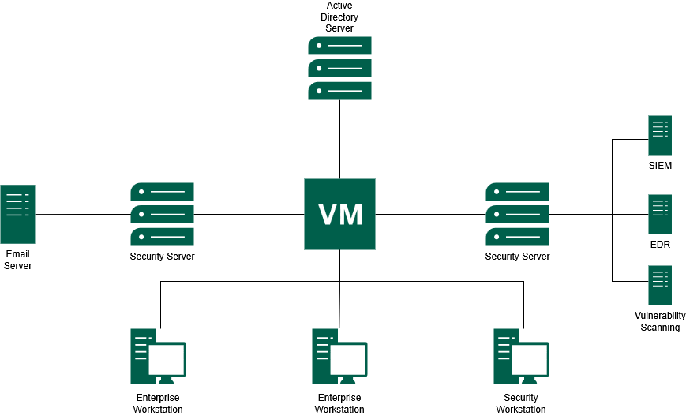
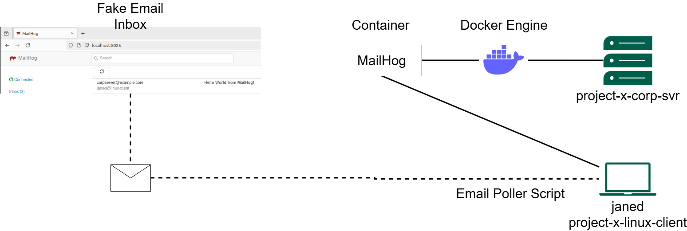
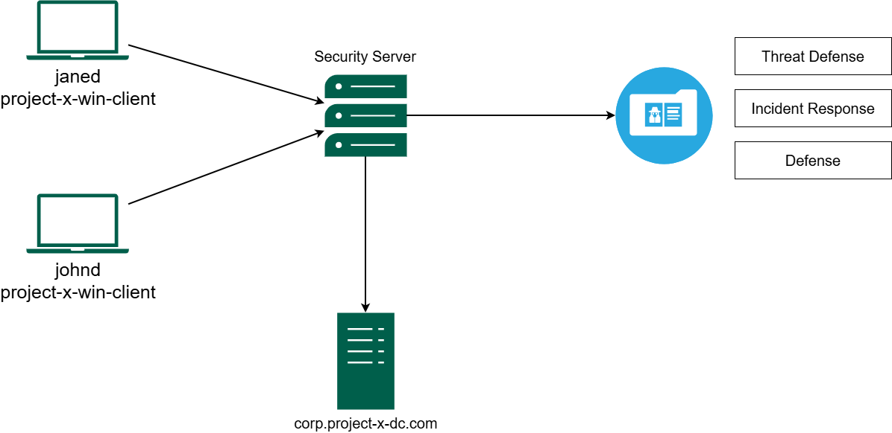

Instead of spinning up a collection of random virtual machines and calling it a homelab, I wanted to build something more meaningful - a small enterprise-like environment that resembles how a real corporate network is structured.

I call this the **Business-in-a-Box** homelab, inspired by the **Project Security E101** course. The goal is to simulate a corporate domain network called **Project X**, complete with internal services, security monitoring, and an attacker node for running controlled offensive exercises.

<!--more-->

Think of it as a self-contained training ground for practising both **attack** and **defence** in a realistic but isolated environment.

## Lab Architecture

The entire environment runs on **Oracle VirtualBox** using a private **NAT network**: `10.0.0.0/24`.

This setup keeps the lab isolated from the host machine, allows safe execution of offensive tooling, and still permits controlled outbound internet access for updates.

The architecture includes:

- **Active Directory infrastructure**
- **Enterprise workstations**
- **Security monitoring platforms**
- **Internal email services**
- **Offensive security systems**

### Figure 1 - Overall Homelab Architecture



*Figure 1 shows the overall structure of the Business-in-a-Box homelab, including the domain controller, enterprise workstations, email server, security server, and monitoring components.*

### Suggested screenshots to include

- VirtualBox VM list showing all homelab machines
- VirtualBox NAT network configuration
- IP configuration from Windows using `ipconfig`
- IP configuration from Linux using `ip a`
- Successful `ping` test between hosts

## Virtual Machines

Each **VM** represents a specific role commonly found in a corporate environment.

| **Hostname** | **IP Address** | **Operating System** | **Role** |
|---|---:|---|---|
| **project-x-dc** | **10.0.0.5** | Windows Server 2025 | **Domain Controller (AD/DNS/DHCP)** |
| **project-x-corp-server** | **10.0.0.8** | Ubuntu Server 22.04 | **Jumpbox & Email Server** |
| **project-x-sec-box** | **10.0.0.10** | Ubuntu Server 22.04 | **Wazuh SIEM Server** |
| **project-x-win-client** | **10.0.0.100** | Windows 11 Enterprise | **Domain Workstation** |
| **project-x-linux-client** | **10.0.0.101** | Ubuntu Desktop 22.04 | **Developer Workstation** |
| **project-x-sec-work** | **10.0.0.103** | Security Onion | **Network Monitoring Workstation** |
| **project-x-attacker** | **10.0.0.50** | Kali Linux 2024.4 | **Attacker Node** |

The minimum specifications per **VM** range from **1 CPU / 2 GB RAM** for lighter machines, such as the corporate server and attacker node, up to **2 CPU / 4 GB RAM** for heavier systems such as the domain controller, Windows client, and security server.

### Suggested screenshots to include

- VirtualBox VM settings for one Windows host
- VirtualBox VM settings for one Linux host
- Hostname configuration screen or terminal output
- VM resource allocation page

## Core Services

The homelab uses several core services to make the environment behave like a small enterprise network.

### Active Directory

The **domain controller** is hosted on **`project-x-dc`** and runs **Windows Server 2025**. It provides:

- **Active Directory Domain Services (ADDS)**
- **DNS services**
- **DHCP services**
- **Centralised authentication**
- **Domain policy management**

All Windows workstations in the lab are joined to the domain **`corp.project-x-dc.com`**. This provides centralised authentication and policy management, similar to what would be found in a real enterprise environment.

### Suggested screenshots to include

- Windows Server Manager dashboard
- Active Directory Users and Computers
- DNS Manager showing domain records
- DHCP configuration screen
- Successful Windows domain join screen
- Windows login using a domain account

## Linux Domain Integration

To support a mixed operating system environment, the Linux workstation is joined to the Active Directory domain using **Samba Winbind**.

This allows Linux systems to authenticate using domain credentials and helps simulate a realistic environment where Windows and Linux machines coexist.

Useful validation commands include:

```bash
realm list
wbinfo -u
id johnd@corp.project-x-dc.com
```

### Suggested screenshots to include

- `realm list` output
- `wbinfo -u` showing domain users
- `id <domain-user>` output
- Winbind service status
- Linux login using domain credentials

## MailHog Email Infrastructure

The email infrastructure is powered by **MailHog**, a lightweight tool that acts as a fake **SMTP server**. It runs inside a **Docker container** on **`project-x-corp-svr`** and is central to the phishing simulations later in this series.

MailHog replaces the need for a real external email provider. This means email-based attack simulations can remain fully contained inside the lab.

### MailHog ports

| **Service** | **Port** | **Purpose** |
|---|---:|---|
| **SMTP** | **1025** | Captures outgoing emails sent by lab scripts or applications |
| **Web Interface** | **8025** | Allows captured emails, headers, and content to be inspected |
| **REST API** | N/A | Enables automated interaction for scripted attack scenarios |

### Figure 2 - MailHog Email Simulation Workflow



*Figure 2 shows how MailHog runs inside Docker on `project-x-corp-svr` and how the Linux client uses an email poller script to simulate inbox activity.*

On the **`project-x-linux-client`** side, a dedicated Bash script called **`email_poller.sh`** runs in the background and periodically polls the MailHog API to simulate a user checking their inbox. When a new email arrives, the script prints an alert to the terminal.

### Suggested screenshots to include

- MailHog web inbox
- Example captured email
- Email headers inside MailHog
- `docker ps` showing the MailHog container
- Docker Compose file or MailHog startup command
- `email_poller.sh` running in terminal
- MailHog API response

## Security Stack

The defensive side of the homelab is built around **Wazuh** and **Security Onion**. Wazuh provides host-based monitoring, while Security Onion provides network-level visibility.

### Figure 3 - Security Monitoring and Defence Architecture



*Figure 3 shows how endpoint activity is collected and forwarded into the security server, where it can be used for threat defence, incident response, and defensive analysis.*

## Wazuh SIEM

**Wazuh** is the main defensive tool in this homelab. It runs on **`project-x-sec-box`** and uses an agent-based model. Lightweight agents are installed on monitored machines and forward telemetry back to the central Wazuh Server.

The three core components are:

- **Wazuh Agents** - installed on `project-x-win-client`, `project-x-linux-client`, and `project-x-dc`. They monitor host-level activity such as system logs, file changes, and rootkit detection.
- **Wazuh Server** - receives all agent data, decodes logs, and runs them against a ruleset library to flag indicators of compromise.
- **Wazuh Indexer and Dashboard** - stores telemetry data and provides a web interface for visualising alerts and performing forensic investigation.

During attack simulations, Wazuh is used to observe the digital footprint left behind at each stage of the attack lifecycle, from initial access to persistence.

### Suggested screenshots to include

- Wazuh dashboard homepage
- Wazuh agent list showing connected hosts
- Security events dashboard
- Failed login detection alert
- File Integrity Monitoring alert
- MITRE ATT&CK mapping page
- Vulnerability detection results

## Security Onion

**Security Onion** runs on **`project-x-sec-work`** and complements Wazuh by providing network-level visibility.

While Wazuh focuses on host-based monitoring, Security Onion handles:

- **Network Security Monitoring (NSM)**
- **Packet capture**
- **Traffic analysis**
- **Suricata alerts**
- **Zeek logs**
- **Threat hunting**

This provides visibility across the lab network, even in situations where host-based telemetry is limited or unavailable.

### Suggested screenshots to include

- Security Onion dashboard
- Packet capture interface
- Suricata alert view
- Zeek log search
- Traffic analysis view
- PCAP investigation screen

## Offensive Environment

The attacker machine, **`project-x-attacker`**, runs **Kali Linux 2024.4** and is loaded with the tools used throughout the attack simulation.

| **Tool** | **Purpose** |
|---|---|
| **Hydra** | Brute-force password attacks |
| **NetExec (`nxc`)** | Credential spraying and lateral movement |
| **Evil-WinRM** | Remote shell access to Windows systems over WinRM |
| **XFreeRDP** | Remote Desktop Protocol access |
| **SecLists** | Curated wordlists for credential attacks |

These tools are used only inside the isolated homelab network for controlled security testing.

### Suggested screenshots to include

- Kali Linux desktop or terminal
- Hydra brute-force output
- NetExec credential spraying output
- Evil-WinRM shell access
- XFreeRDP session to Windows workstation
- Wazuh alert generated from offensive activity

## Test Credentials

Weak credentials are intentionally configured throughout the lab to make the attack simulation possible. These credentials are for homelab use only.

> **Important:** Do not use these credentials outside the lab. They are intentionally weak and should never be reused in real systems.

| **Account** | **Password** | **Host** |
|---|---|---|
| `Administrator` | `@Deeboodah1!` | **project-x-dc** |
| `johnd@corp.project-x-dc.com` | `@password123!` | **project-x-win-client** |
| `jane@linux-client` | `@password123!` | **project-x-linux-client** |
| `sec-user@sec-box` | `@password123!` | **project-x-sec-box** |
| `attacker` | `attacker` | **project-x-attacker** |

### Suggested screenshots to include

- Domain login prompt
- Successful SSH login
- Failed login attempts
- Password spraying test output
- Wazuh failed login alert

## Conclusion

This completes the foundational setup of the **Business-in-a-Box** cybersecurity homelab. The environment now includes a domain controller, enterprise workstations, internal email infrastructure, security monitoring platforms, and an attacker node.

In **Part 2**, I will deliberately misconfigure several services across the lab to create a realistically vulnerable environment and connect those activities into Wazuh for detection.